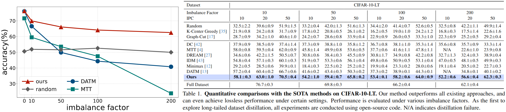

# Distilling Long-tailed Datasets

## [Paper](https://arxiv.org/abs/2408.14506) 
Existing DD methods exhibit degraded performance when applied to imbalanced datasets, especially when the imbalance factor increases, whereas our method provides significantly better performance under different imbalanced scenarios.




## Getting Started
1. Create environment as follows
```
conda env create -f environment.yaml
conda activate distillation
```
2. Generate expert trajectories
```
cd buffer

# representation experts
python buffer_FTD.py --cfg ../configs/buffer/CIFAR10_LT/imbrate_0005/first_stage_weight_balance.yaml

# classifier experts
python buffer_FTD.py --cfg ../configs/buffer/CIFAR10_LT/imbrate_0005/second_stage_weight_balance.yaml
```
3. Perform the distillation
```
cd distill
python EDGE_tesla.py --cfg ../configs/xxxx.yaml
```

## Acknowledgement
Our code is built upon [MTT](https://github.com/GeorgeCazenavette/mtt-distillation), [FTD](https://github.com/AngusDujw/FTD-distillation), and [DATM](https://github.com/NUS-HPC-AI-Lab/DATM).
## Citation
If you find our code useful for your research, please cite our paper.
```
@article{zhao2024distilling,
  title={Distilling Long-tailed Datasets},
  author={Zhao, Zhenghao and Wang, Haoxuan and Shang, Yuzhang and Wang, Kai and Yan, Yan},
  journal={arXiv preprint arXiv:2408.14506},
  year={2024}
}
```
